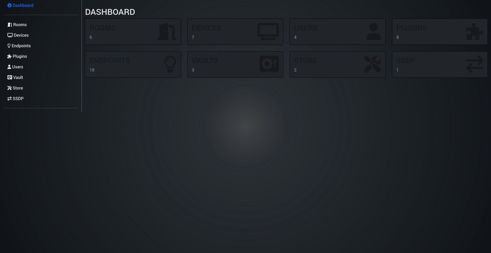
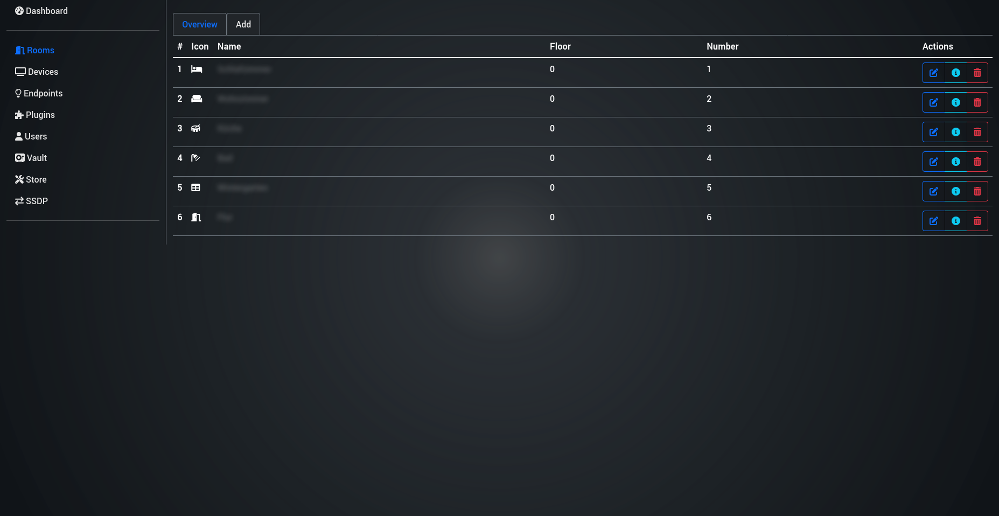
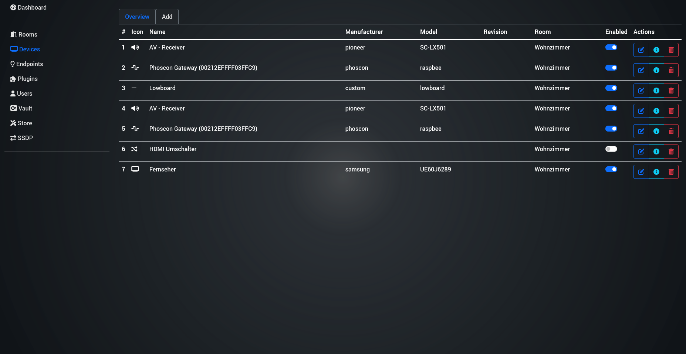
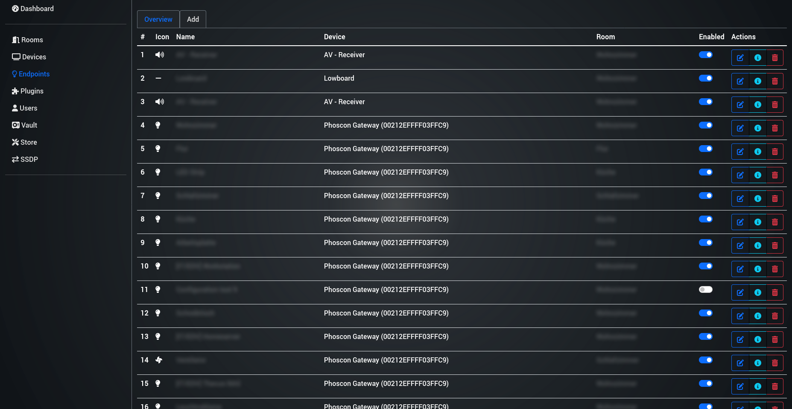
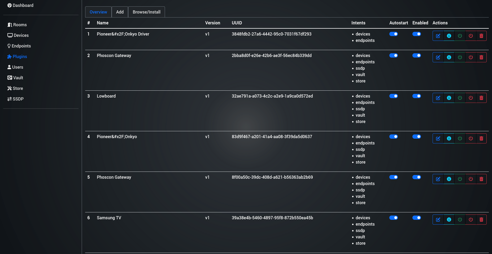
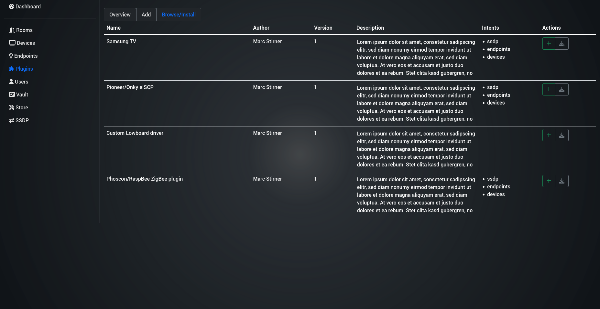
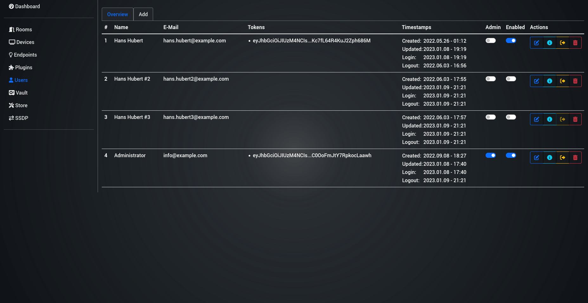
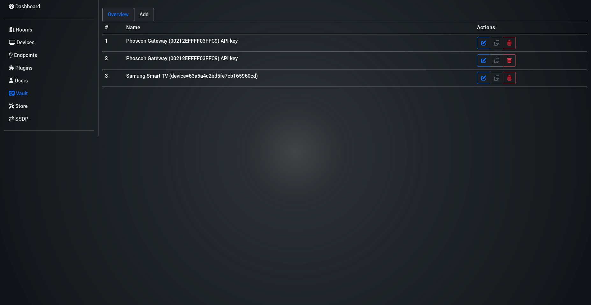
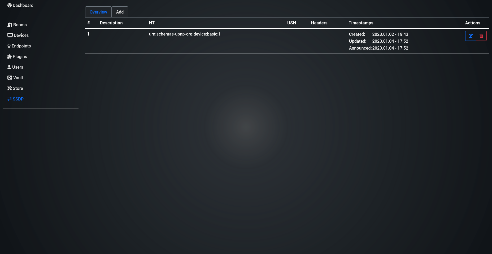

# vue-project

This template should help get you started developing with Vue 3 in Vite.

## Recommended IDE Setup

[VSCode](https://code.visualstudio.com/) + [Volar](https://marketplace.visualstudio.com/items?itemName=johnsoncodehk.volar) (and disable Vetur) + [TypeScript Vue Plugin (Volar)](https://marketplace.visualstudio.com/items?itemName=johnsoncodehk.vscode-typescript-vue-plugin).

## Customize configuration

See [Vite Configuration Reference](https://vitejs.dev/config/).

## Project Setup

> NOTE: You need to run the [backend](https://github.com/OpenHausIO/backend) to develop the frontend
> E.g. as [Docker Container](https://github.com/OpenHausIO/backend/blob/main/docs/DOCKER.md) or application on the host machine

```sh
npm install
```

### Create Admin account
```sh
curl -v -X PUT --unix-socket /tmp/open-haus.sock \
   http://127.0.0.1:8080/api/users \
   -H "Content-Type: application/json" \
   -d '{"email":"info@example.com","password":"Pa$$w0rd", "name":"Administrator", "enabled": "true", "admin": "true"}'
```

### Compile and Hot-Reload for Development

```sh
npm run dev
```

### Compile and Minify for Production

```sh
npm run build
```

## Docker

### Environment variables
| Name             | Default value                    | Description                                          |
| ---------------- | -------------------------------- | ---------------------------------------------------- |
| NODE_ENV         | `production`                     | node.js environment                                  |
| NGINX_PORT       | `3001`                           | nginx http port                                      |
| NGINX_HOSTNAME   | `open-haus.lan, open-haus.local` | nginx hostname                                       |
| BACKEND_PROTOCOL | `http`                           | OpenHaus backend http protocol                       |
| BACKEND_HOST     | `127.0.0.1`                      | OpenHaus backend http host                           |
| BACKEND_PORT     | `8080`                           | OpenHaus backend http port                           |
| RESOLVER         | `127.0.0.11`                     | DNS resolver used inside the backend location block. |

### Build
```sh
npm run build:docker
```

### Export the Image
```sh
docker save openhaus/admin-frontend:latest | gzip > ./admin-frontend-vX.X.X-docker.tgz
```

### Start a container
```sh
docker run --net=host --name=admin-frontend openhaus/admin-frontend:latest
```
The host network is neede when you run the backend on the docker host itself.<br />
If you use the backend in a container or the "Quick-Start" docker example, its not needed.

## Description
This is a User Interface for the HTTP backend API.<br />
Its basicly a GUI for the [postman collection](https://github.com/OpenHausIO/backend/blob/dev/postman.json).

> The "Admin frontend" is a early work in progress project, that doesn't get the love it needs.

## Screenshots

--

--

--

--

--

--

--

--
